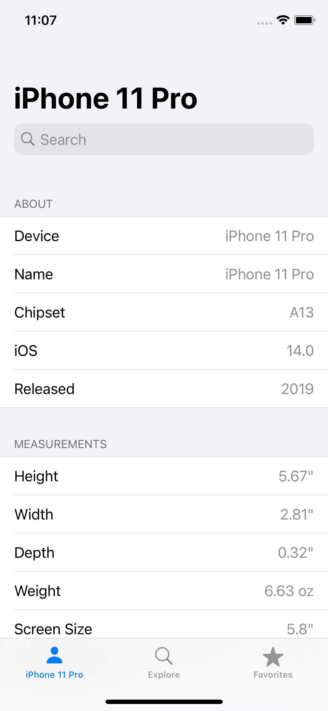
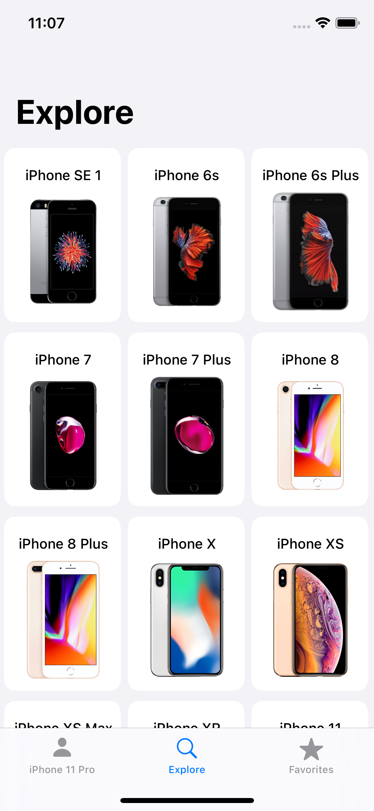
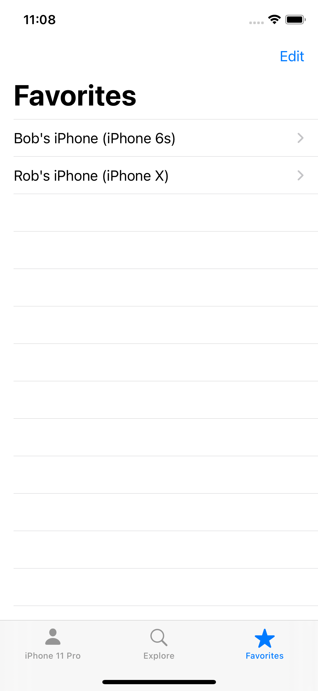

# Infone

  

Infone is an iOS app that gives you important information about your iPhone such as it's screen size or water resistance. 
It also allows you to browse other iOS devices too with the ability to save and name them so you can access these device's information again with ease.
